# Gallbladder Disease Image Classification Benchmark

This repository benchmarks 10 lightweight PyTorch image classifiers for gallbladder disease classification on Apple Silicon using the MPS backend. The aim is not just to train models, but to compare accuracy, robustness, training cost, inference speed, parameter count, and model-size tradeoffs under one shared protocol.

The benchmark was run in multiple sessions and then compiled into one final report. The compiler selects the completed result for each model from `outputs/runs`, verifies that all 10 models have `history.csv` and `metrics.json`, and writes a consolidated report to `reports/final_benchmark`.

## Final Summary

- Best test macro F1: `shufflenet_v2_x1_0` at `0.8500`
- Best test accuracy: `efficientnet_b1` at `0.7727`
- Best ROC-AUC: `densenet121` at `0.9609`
- Fastest inference: `mobilenet_v3_small` at `4627.18` images/sec
- Smallest model: `squeezenet1_1` with `727,113` parameters
- Best practical speed/accuracy balance: `shufflenet_v2_x1_0` and `mobilenet_v3_small`

## Dataset

The local dataset used for this benchmark contained 9 classes and 13,872 images.

```text
train: 9,710
validation: 2,081
test: 2,081
```

Class folders are expected under:

```text
Gallblader Diseases Dataset/
  1Gallstones/
  2Abdomen and retroperitoneum/
  3cholecystitis/
  4Membranous and gangrenous cholecystitis/
  5Perforation/
  6Polyps and cholesterol crystals/
  7Adenomyomatosis/
  8Carcinoma/
  9Various causes of gallbladder wall thickening/
```

The dataset itself is not committed to this repository.

## Models

The benchmark intentionally avoids very large models such as VGG and compares efficient architectures:

- `mobilenet_v3_small`
- `mobilenet_v3_large`
- `efficientnet_b0`
- `efficientnet_b1`
- `densenet121`
- `densenet169`
- `resnet18`
- `resnet34`
- `squeezenet1_1`
- `shufflenet_v2_x1_0`

## Methodology

All models use the same setup:

- Image size: 224x224
- Input mode: RGB
- Split: stratified train/validation/test
- Epochs: 50
- Optimizer: AdamW
- Learning rate: `3e-4`
- Weight decay: `1e-4`
- Scheduler: cosine annealing
- Pretraining: torchvision ImageNet weights
- Class imbalance handling: weighted random sampler
- Checkpoint selection: best validation macro F1
- Final evaluation: held-out test split
- Inference benchmark: warmup batches followed by measured test batches
- Device: Apple Silicon MPS via `torch.device("mps")`

The run prints PyTorch/MPS availability, MPS memory, parameter counts, tqdm progress, train/validation metrics, epoch time, and inference timing.

## Classification Results

Sorted by test macro F1.

| model | run | accuracy | balanced_accuracy | macro_f1 | macro_roc_auc_ovr | macro_average_precision |
| --- | --- | --- | --- | --- | --- | --- |
| shufflenet_v2_x1_0 | 20260601_114302 | 0.7713 | 0.8644 | 0.8500 | 0.9592 | 0.8556 |
| efficientnet_b1 | 20260601_004804 | 0.7727 | 0.8663 | 0.8492 | 0.9596 | 0.8556 |
| densenet121 | 20260601_114302 | 0.7713 | 0.8649 | 0.8490 | 0.9609 | 0.8585 |
| resnet18 | 20260601_114302 | 0.7693 | 0.8631 | 0.8487 | 0.9572 | 0.8521 |
| efficientnet_b0 | 20260601_004804 | 0.7689 | 0.8626 | 0.8481 | 0.9602 | 0.8561 |
| mobilenet_v3_small | 20260601_004804 | 0.7655 | 0.8593 | 0.8455 | 0.9585 | 0.8538 |
| squeezenet1_1 | 20260601_114302 | 0.7636 | 0.8552 | 0.8445 | 0.9590 | 0.8554 |
| densenet169 | 20260601_114302 | 0.7650 | 0.8593 | 0.8439 | 0.9597 | 0.8557 |
| resnet34 | 20260601_114302 | 0.7669 | 0.8620 | 0.8436 | 0.9606 | 0.8574 |
| mobilenet_v3_large | 20260601_004804 | 0.7612 | 0.8546 | 0.8417 | 0.9561 | 0.8498 |

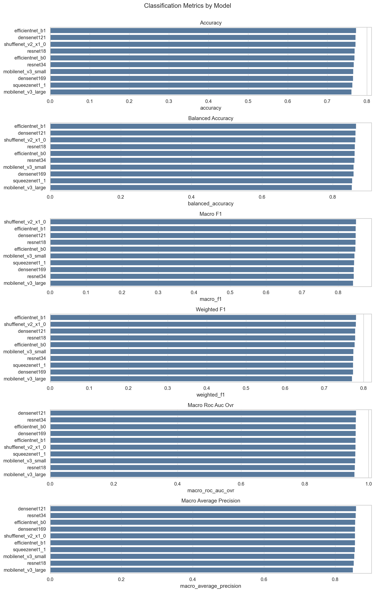

## Efficiency Results

Sorted by inference throughput.

| model | total_params | model_state_mb | train_seconds | inference_images_per_second | inference_latency_ms_per_image_mean |
| --- | --- | --- | --- | --- | --- |
| mobilenet_v3_small | 1,527,081 | 5.8718 | 11.8 min | 4627.1806 | 0.2161 |
| squeezenet1_1 | 727,113 | 2.7737 | 10.6 min | 3253.4315 | 0.3074 |
| shufflenet_v2_x1_0 | 1,262,829 | 4.8795 | 14.5 min | 3156.3711 | 0.3168 |
| mobilenet_v3_large | 4,213,561 | 16.1669 | 23.5 min | 1666.0737 | 0.6002 |
| resnet18 | 11,181,129 | 42.6894 | 24.1 min | 1523.4071 | 0.6564 |
| efficientnet_b0 | 4,019,077 | 15.4922 | 42.0 min | 1009.8917 | 0.9902 |
| resnet34 | 21,289,289 | 81.2774 | 39.0 min | 891.7389 | 1.1214 |
| efficientnet_b1 | 6,524,713 | 25.1270 | 58.7 min | 738.4027 | 1.3543 |
| densenet121 | 6,963,081 | 26.8821 | 72.6 min | 423.4609 | 2.3615 |
| densenet169 | 12,499,465 | 48.2872 | 85.5 min | 385.0517 | 2.5971 |

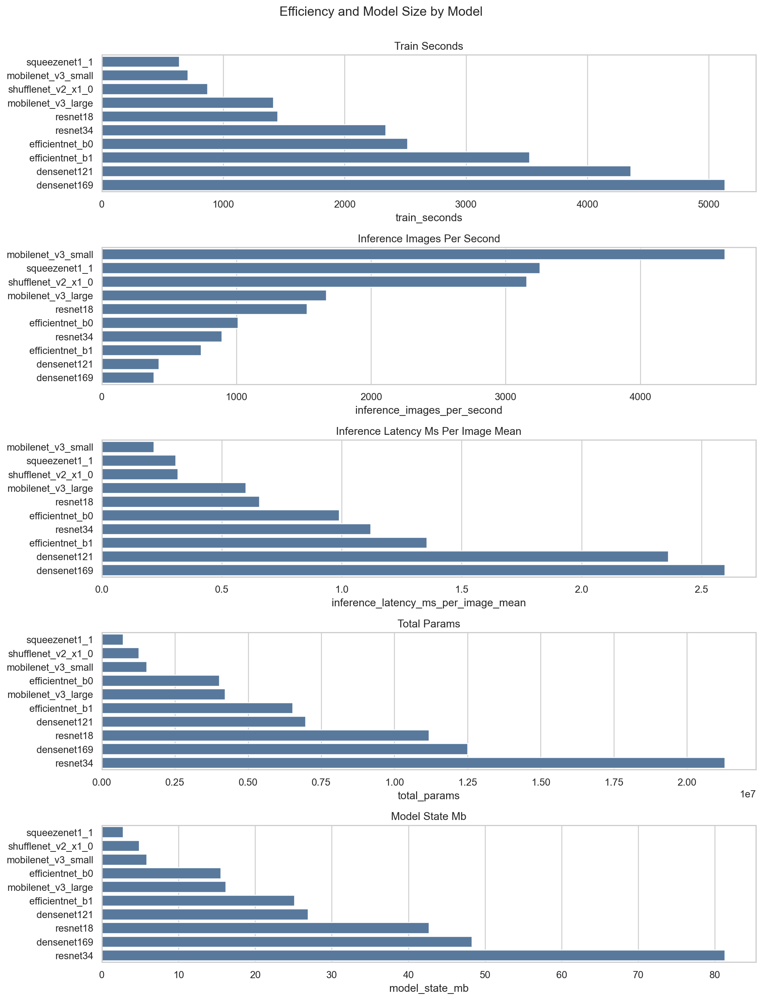

## Learning History

The final epoch values are close across models, which suggests the benchmark is separating models more by efficiency and stability than by raw accuracy. The top validation macro F1 values cluster around `0.83` to `0.84`, while test macro F1 clusters around `0.84` to `0.85`.

| model | epoch | train_loss | val_loss | train_accuracy | val_accuracy | train_macro_f1 | val_macro_f1 |
| --- | --- | --- | --- | --- | --- | --- | --- |
| resnet18 | 50 | 0.2593 | 0.4310 | 0.8665 | 0.7559 | 0.8667 | 0.8401 |
| shufflenet_v2_x1_0 | 50 | 0.2674 | 0.4177 | 0.8625 | 0.7573 | 0.8614 | 0.8400 |
| densenet169 | 50 | 0.2561 | 0.4346 | 0.8686 | 0.7564 | 0.8674 | 0.8397 |
| densenet121 | 50 | 0.2538 | 0.4367 | 0.8728 | 0.7530 | 0.8724 | 0.8373 |
| mobilenet_v3_small | 50 | 0.2535 | 0.4306 | 0.8713 | 0.7511 | 0.8683 | 0.8365 |
| mobilenet_v3_large | 50 | 0.2495 | 0.4335 | 0.8730 | 0.7487 | 0.8705 | 0.8344 |
| resnet34 | 50 | 0.2576 | 0.4316 | 0.8700 | 0.7482 | 0.8649 | 0.8343 |
| efficientnet_b1 | 50 | 0.2573 | 0.4548 | 0.8718 | 0.7472 | 0.8665 | 0.8329 |
| efficientnet_b0 | 50 | 0.2551 | 0.4422 | 0.8709 | 0.7458 | 0.8667 | 0.8325 |
| squeezenet1_1 | 50 | 0.2673 | 0.4349 | 0.8607 | 0.7424 | 0.8616 | 0.8302 |

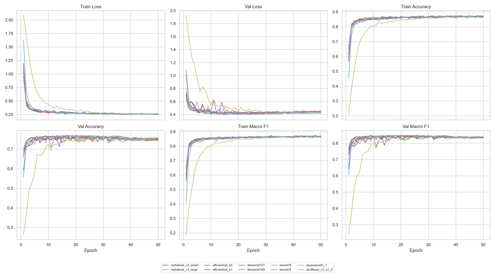

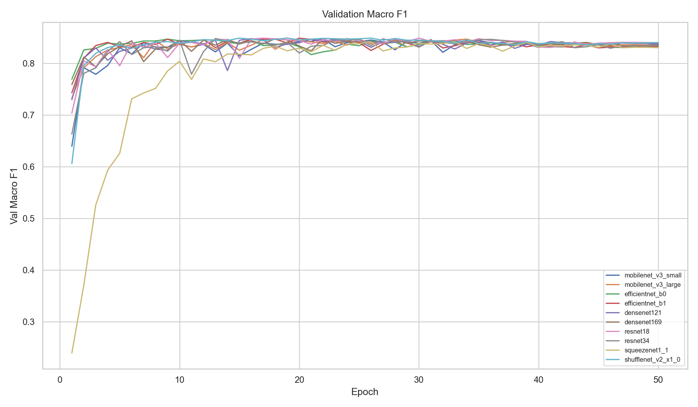

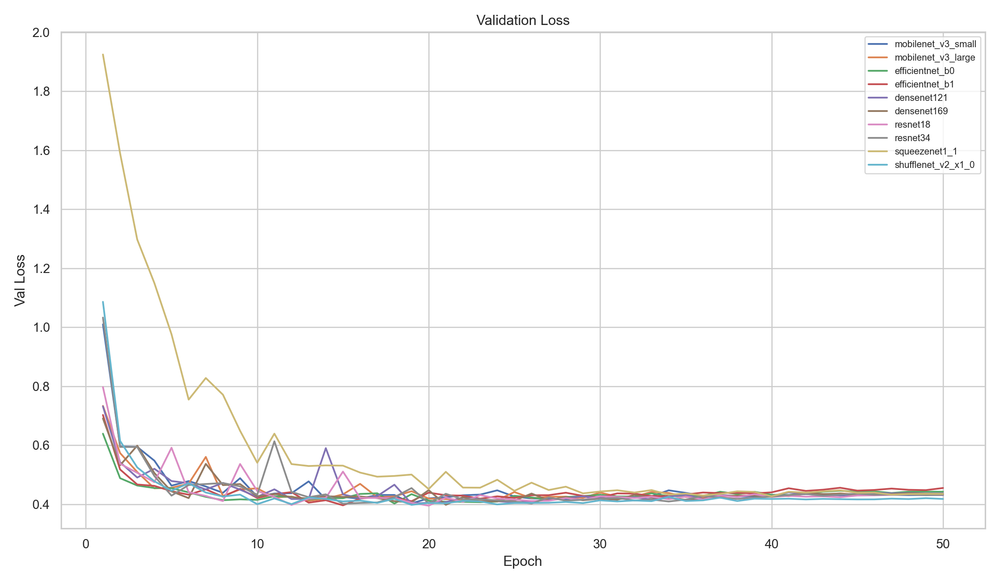

## Tradeoff Analysis

The best model by pure macro F1 is `shufflenet_v2_x1_0`, but the margin over `efficientnet_b1`, `densenet121`, and `resnet18` is very small. The difference between the top model and the fifth model is under `0.002` macro F1, so efficiency matters a lot here.

`mobilenet_v3_small` is the strongest deployment-style model. It is not the top scorer, but it is very close in macro F1 while being the fastest inference model by a wide margin. `squeezenet1_1` is the smallest model and trains quickly, but it gives up a little classification quality.

DenseNet models perform well by ROC-AUC and average precision, but they are the slowest in this benchmark. `densenet169` is especially expensive here without improving macro F1 over the lighter alternatives.

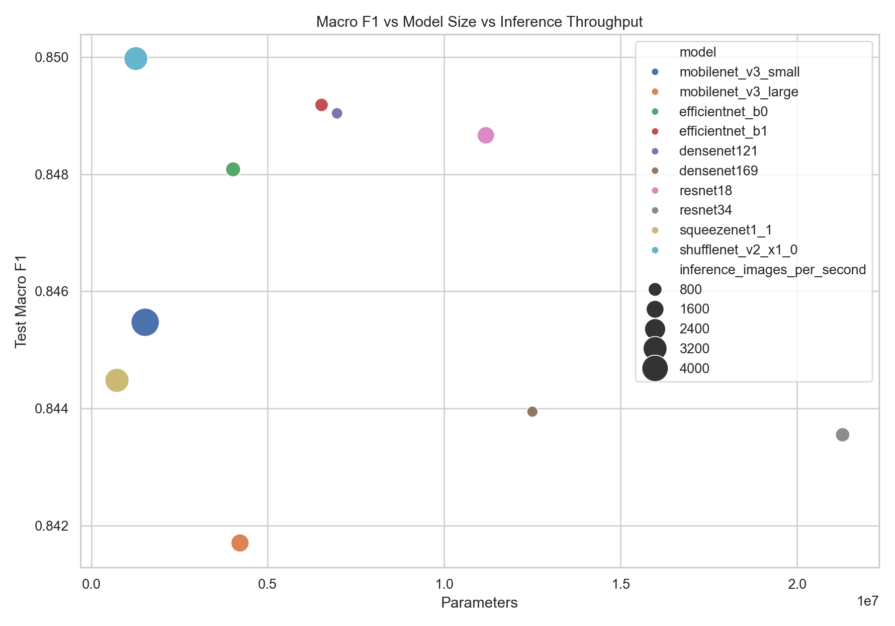

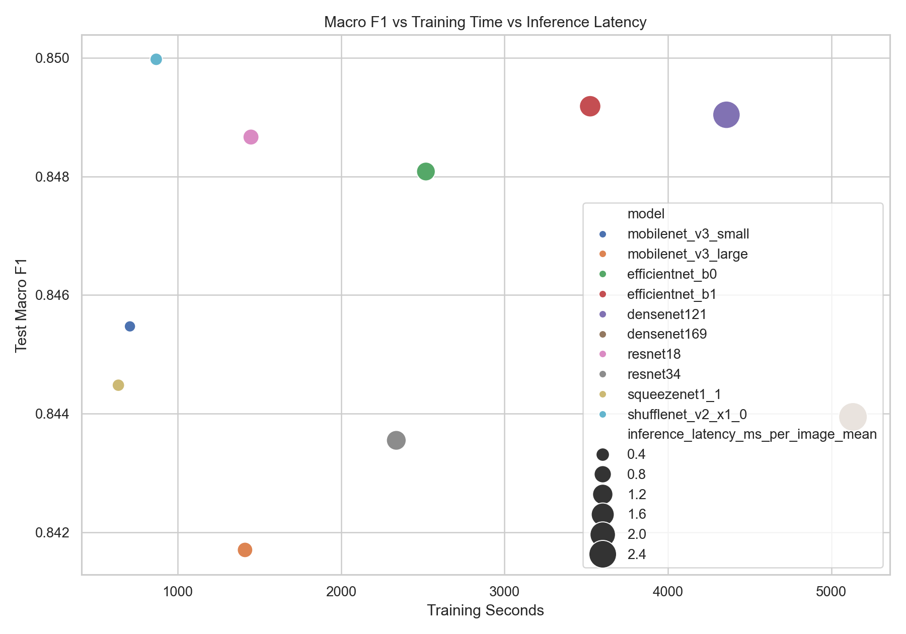

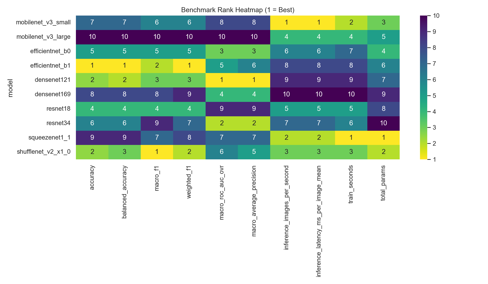

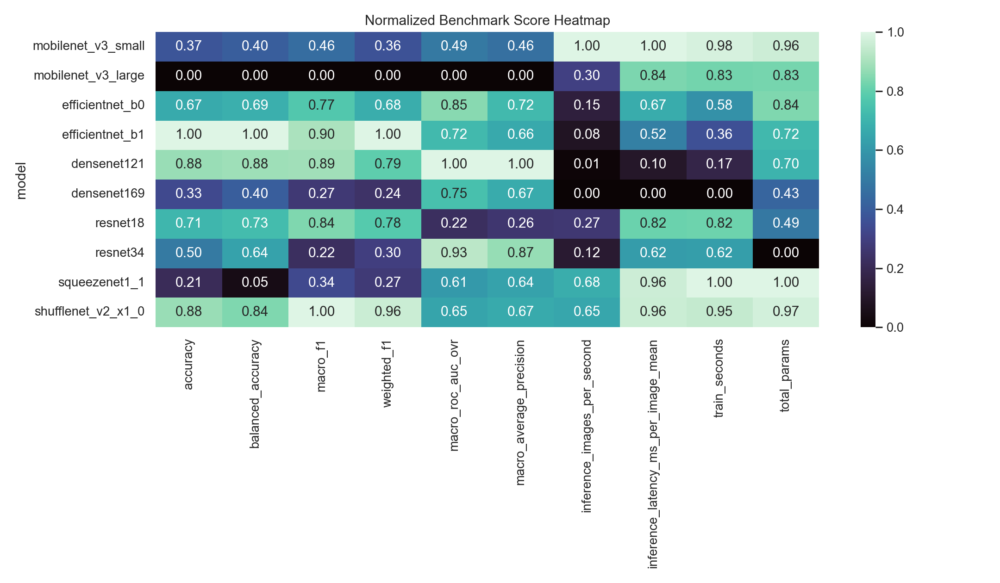

## Additional Comparison Tables

The final report also includes decision-oriented tables derived from the completed benchmark outputs.

| category | model | metric |
| --- | --- | --- |
| Best macro F1 | `shufflenet_v2_x1_0` | `0.8500` |
| Best accuracy | `efficientnet_b1` | `0.7727` |
| Best ROC-AUC | `densenet121` | `0.9609` |
| Best average precision | `densenet121` | `0.8585` |
| Fastest inference | `mobilenet_v3_small` | `4627.18` images/sec |
| Lowest latency | `mobilenet_v3_small` | `0.2161` ms/image |
| Smallest model | `squeezenet1_1` | `727,113` parameters |
| Fastest training | `squeezenet1_1` | `10.6` min |
| Best balanced deployment score | `shufflenet_v2_x1_0` | `0.9004` |

The aggregate rank table combines accuracy, speed, latency, size, training cost, balanced score, and ROC-AUC. Lower average rank is better.

| model | average_rank | note |
| --- | --- | --- |
| `shufflenet_v2_x1_0` | `2.71` | Best overall rank |
| `mobilenet_v3_small` | `3.29` | Fastest and strong accuracy |
| `squeezenet1_1` | `3.29` | Smallest and fastest training |
| `efficientnet_b0` | `5.14` | Strong accuracy, moderate cost |
| `resnet18` | `5.71` | Good accuracy, larger model |

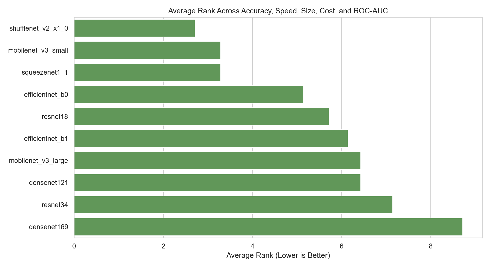

## Pareto Frontier

The Pareto analysis marks a model as non-dominated if no other model is simultaneously better or equal in macro F1, inference throughput, parameter count, and training time, with at least one strict improvement. Three models sit on the frontier:

- `mobilenet_v3_small`: fastest inference with strong accuracy
- `squeezenet1_1`: smallest and fastest to train
- `shufflenet_v2_x1_0`: best accuracy/efficiency balance

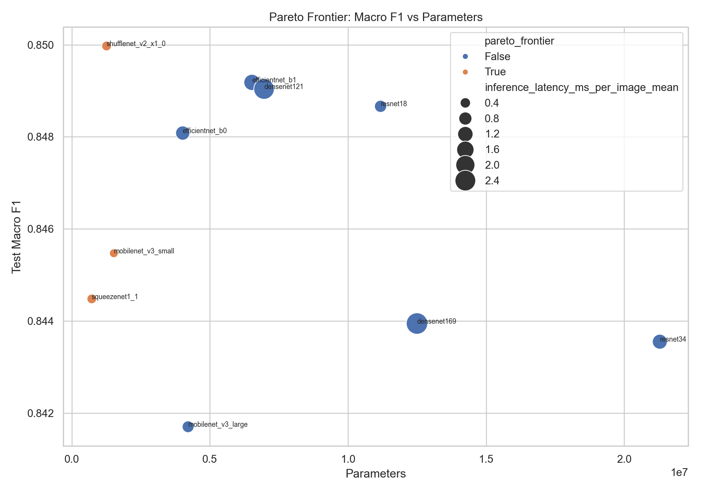

## Derived Efficiency Scores

The report computes extra no-retraining efficiency ratios:

- `macro_f1_per_million_params`
- `macro_f1_per_training_minute`
- `macro_f1_per_ms_latency`
- `throughput_per_million_params`
- `balanced_deployment_score`

The balanced score uses normalized macro F1, inference speed, model size, and training speed. Under that combined score, `shufflenet_v2_x1_0` ranks first, followed by `mobilenet_v3_small` and `squeezenet1_1`.

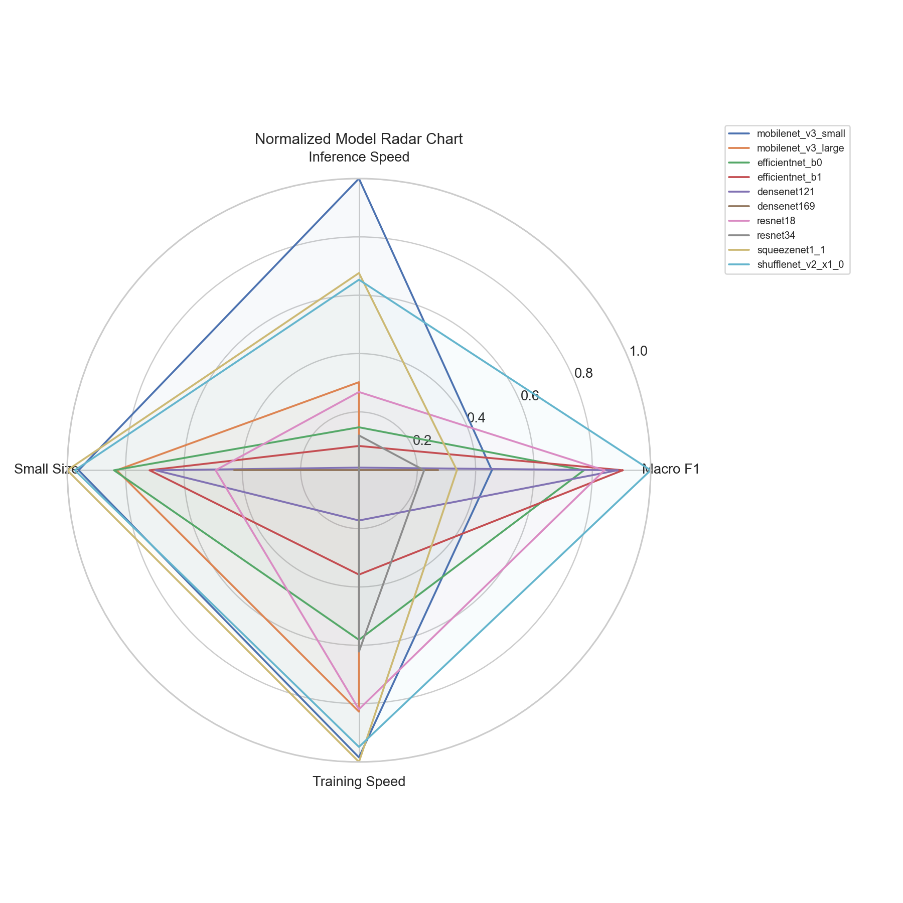

## Generalization, Convergence, and Stability

The generalization gap compares final training metrics against final validation metrics. Smaller gaps suggest less overfitting. `shufflenet_v2_x1_0` had the smallest final macro-F1 gap, while `mobilenet_v3_large` had the largest among these runs.

The convergence table records the best validation epoch, the first epoch reaching 95% of final validation macro F1, final-vs-best degradation, and late-epoch metric variability. Most models reached 95% of their final validation macro F1 very early, which suggests that later epochs mostly refined already-learned decision boundaries.

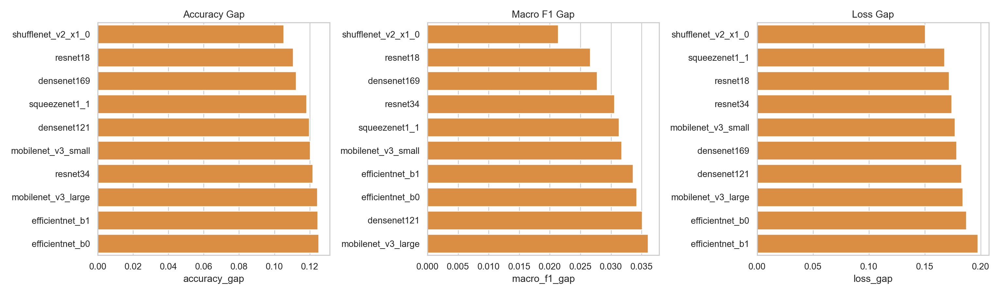

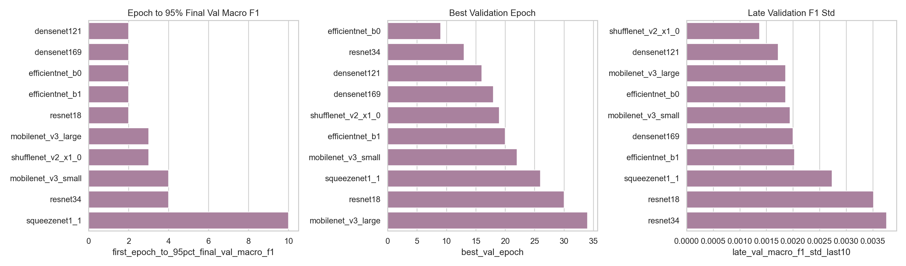

## Metric Relationships

The metric correlation heatmap checks whether larger and slower models actually improved score. In this benchmark, the relationship is not simple: larger models were not automatically better, and the strongest deployment candidates came from smaller architectures.

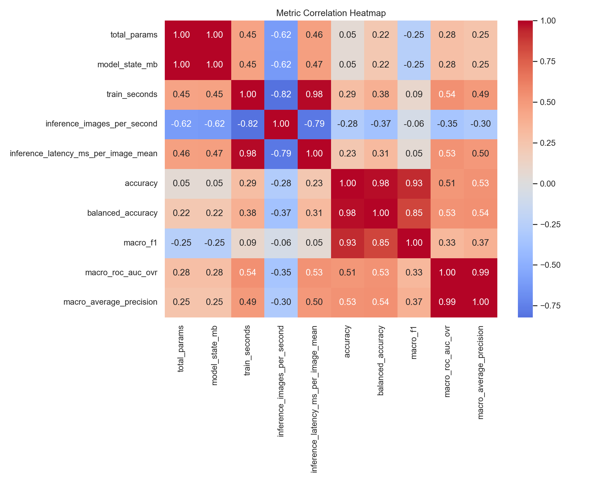

## Model Family Comparison

Family-level averages are included for MobileNet, EfficientNet, DenseNet, ResNet, SqueezeNet, and ShuffleNet. Since some families have one model and others have two, this is a descriptive comparison, not a statistical claim.

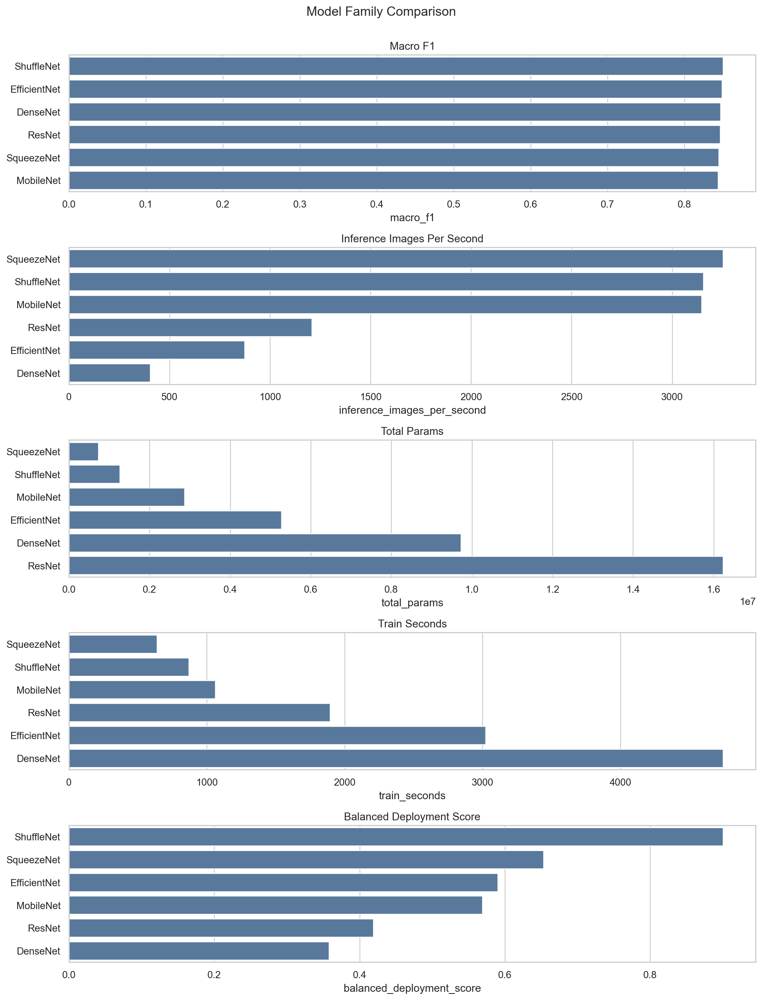

## Confusion Analysis

The final report aggregates the most common true-class to predicted-class mistakes across models. This is helpful because two models can have similar macro F1 but different clinical error profiles.

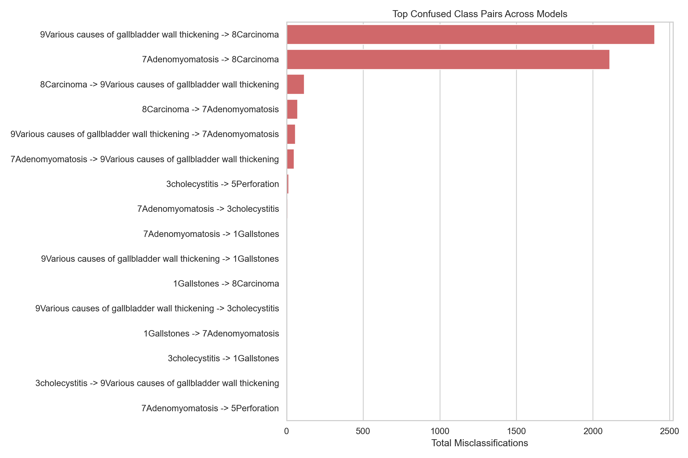

## Per-Class Behavior

The per-class heatmaps show that the models are broadly similar, but not identical, in their error profile. These plots are useful when picking a model for a class-sensitive workflow, because the highest overall macro F1 model is not always the best model for every individual class.

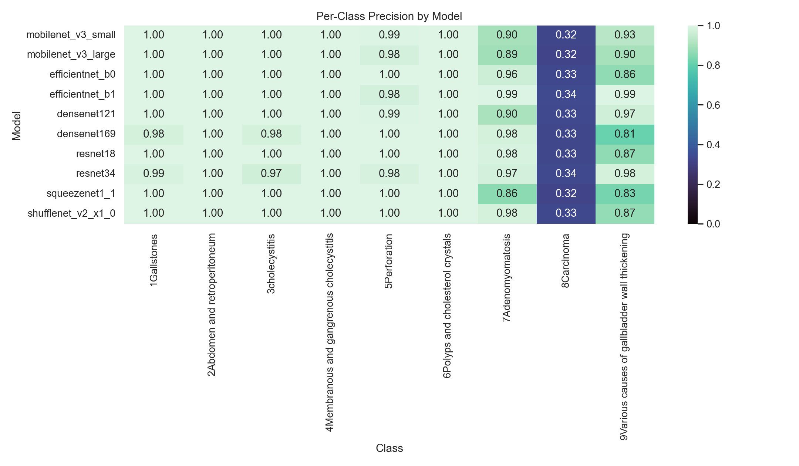

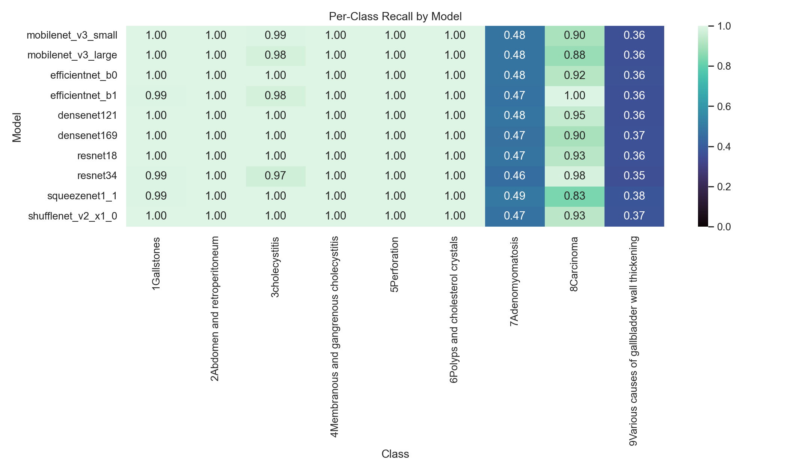

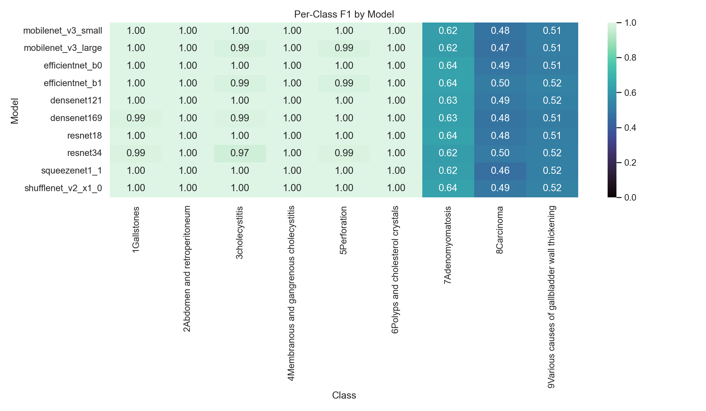

## Learning Rate Schedule

All models start with the same learning rate: `3e-4`. The learning rate values printed in the terminal differ by epoch because the training script uses `torch.optim.lr_scheduler.CosineAnnealingLR`.

The schedule follows a cosine decay over 50 epochs:

```text
lr(epoch) moves smoothly from 3e-4 toward 0 across the run
```

This is why the log shows values like `0.00029970`, `0.00029882`, and eventually `0.0`. It is not giving each model a different initial learning rate. Each model receives the same schedule, restarted from the beginning for that model.

Cosine annealing is useful here because the first epochs can make larger updates while pretrained features adapt to the gallbladder dataset, and later epochs use smaller updates to refine the decision boundary without bouncing around as much. A single fixed learning rate is simpler, but it forces one compromise value for the entire run: high enough for early progress, or low enough for late stability. Cosine annealing gives both phases in one schedule.

## Discussion

The results show a tight accuracy band. All 10 models reached roughly comparable test performance, with macro F1 between `0.8417` and `0.8500`. That means model choice should not be based only on the top-line score. In this dataset, the practical question is which model gives enough accuracy for the least cost.

For a balanced benchmark winner, `shufflenet_v2_x1_0` is compelling: it achieved the best macro F1 while staying small and fast. For maximum throughput, `mobilenet_v3_small` is the clear pick. It is over 10x faster than DenseNet models in measured inference throughput while losing only about `0.0045` macro F1 compared with the top score.

`efficientnet_b1` produced the highest test accuracy and second-best macro F1, but it trained much longer and inferred slower than the MobileNet/ShuffleNet models. `densenet121` had the best ROC-AUC and average precision, suggesting strong ranking behavior, but its training and inference costs are high.

The validation curves suggest the models converge early and then refine slowly. The training macro F1 is consistently higher than validation macro F1, indicating some generalization gap. Additional work should evaluate stronger augmentation, patient-level leakage prevention if patient identifiers exist, calibration, external validation, and repeated seeds.

## Reproduce Training

Full benchmark:

```bash
uv run python scripts/train_all.py --device mps --epochs 50 --image-size 224 --batch-size 32 --num-workers 8
```

If memory pressure is high:

```bash
uv run python scripts/train_all.py --device mps --epochs 50 --image-size 224 --batch-size 16 --num-workers 4
```

If an operation lacks MPS support:

```bash
PYTORCH_ENABLE_MPS_FALLBACK=1 uv run python scripts/train_all.py --device mps --epochs 50 --image-size 224 --batch-size 32 --num-workers 8
```

Compile the final report from completed runs:

```bash
uv run python scripts/compile_final_report.py
```

## Report Artifacts

Final report files are in:

```text
reports/final_benchmark/
```

Important files:

- `benchmark_summary.csv`
- `model_parameters.csv`
- `history_all_models.csv`
- `all_completed_run_candidates.csv`
- `summary.json`
- `classification_metrics_comparison.png`
- `efficiency_metrics_comparison.png`
- `history_dashboard_all_models.png`
- `accuracy_size_throughput.png`
- `accuracy_train_time_latency.png`
- `benchmark_rank_heatmap.png`
- `benchmark_normalized_heatmap.png`
- `decision_table.csv`
- `efficiency_scores.csv`
- `rank_aggregation.csv`
- `average_rank_comparison.png`
- `pareto_frontier.csv`
- `pareto_frontier_accuracy_params.png`
- `radar_model_profiles.png`
- `generalization_gap.csv`
- `generalization_gap_comparison.png`
- `convergence_stability.csv`
- `convergence_stability_comparison.png`
- `metric_correlation.csv`
- `metric_correlation_heatmap.png`
- `model_family_comparison.csv`
- `model_family_comparison.png`
- `confusion_pairs_by_model.csv`
- `confusion_pairs_overall.csv`
- `top_confusion_pairs.png`
- `per_class_best_models.csv`
- `model_report_cards.csv`
- `per_class_metrics_long.csv`
- `per_class_precision_heatmap.png`
- `per_class_recall_heatmap.png`
- `per_class_f1_heatmap.png`

## Medical Note

This benchmark is for research and engineering comparison only. It is not a clinical diagnostic system. Medical deployment would require careful dataset documentation, leakage checks, patient-level splitting, calibration, external validation, and review by qualified clinical experts.
